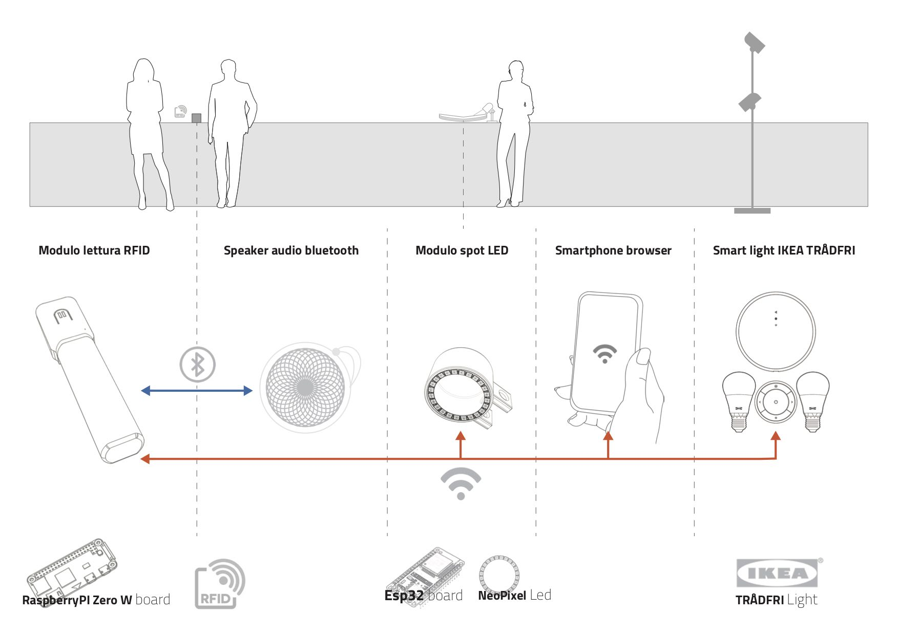
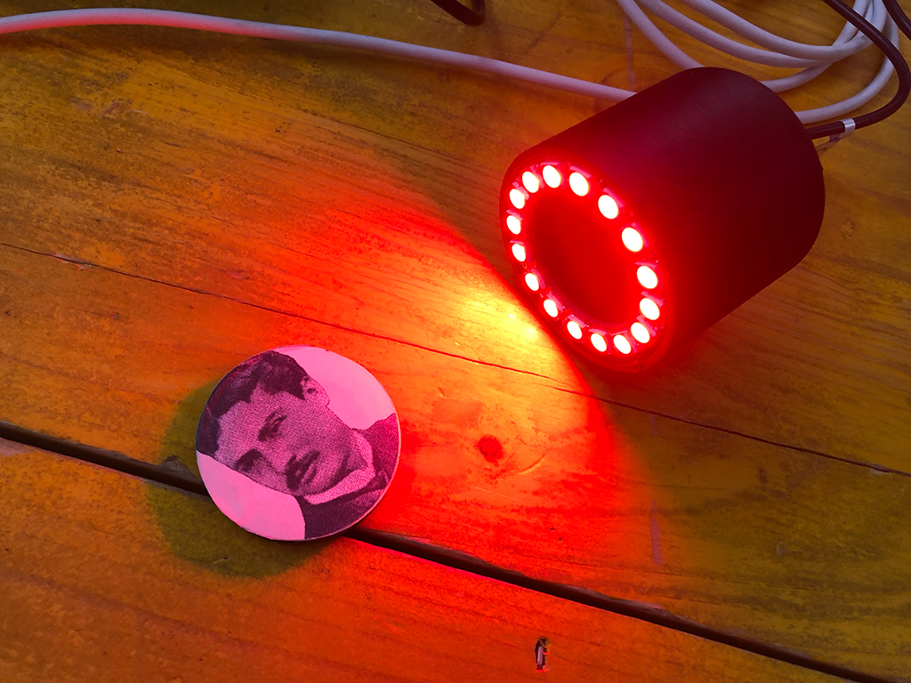

# openMuseum

## 1.0 Il progetto

### 1.1 Descrizione generale del progetto

Il Progetto di ricerca triennale “Nuovi sistemi integrativi per la fruizione del percorso espositivo della Casa Museo“ ha coinvolto in un programma di progettazione partecipata un gruppo di ricerca dell’area Exhibit e Interaction Design dell’Università delgi Studi della Repubblica di San Marino e le otto Istituzioni del Coordinamento delle Case Museo dei Poeti e degli Scrittori di Romagna (Protocollo di intesa sottoscritto dall’Università e dal Comune di Forlì, in qualità di Comune capofila del Coordinamento delle Case Museo dei Poeti e degli Scrittori di Romagna in data 18 luglio 2017).

### 1.2	Componenti hardware progettati

- [Reader RFID](https://github.com/unirsm/openMuseum/blob/master/reader/README.md)
- [Spot Light neopixel](spotNeopixel/README.md)
- [Server](https://github.com/unirsm/openMuseum/blob/master/server/README.md)

### 1.3 Gruppo di lavoro progetto

Alessandra Bosco, Elena La Maida, Emanuele Lumini, Mirco Piccin e Michele Zannoni

## 2.0 Analisi preliminare e presupposti di progetto

### 2.1 Contesto

 - Case museo eterogenee con tipologie molto diverse di percorsi
   espositivi.
- Spazi liberi vuoti o stanze arredate.

### 2.2 Vincoli delle case museo

Necessità di un intervento non invasivo
- Impossibilità di fare interventi strutturali in diverse sale che alterino l’allestimento storico
- Allaccio alla rete elettrica molto problematico e troppo invasivo per alcuni contesti espositivi
- Non caricare dal punto di vista elettrico le strutture espositive
- Necessità dell’uso di una batteria e di un processo di ricarica semplice
- Sistema di ricarica della batteria certificato
- Personale eterogeneo e non preparato che può essere formato
- Problemi di connessione delle case
- Costo molto basso dell’oggetto interattivo
- Facilità e flessibilità d’uso

### 2.3	Presupposti

- Evitare l’inserimento di elementi estranei alle case museo evitando schermi e sistemi visivi permanenti
- Sviluppo di un sistema aperto e implementabile dagli operatori
- Dimensione contenuta degli oggetti
- Visibilità degli oggetti

### 2.4	Obiettivi principali

Gestione della presenza del visitatore nello spazio e attivazione di processi di interazione con contenuti audio e video.
- Permettere la contestualizzazione di un audio narrativo localizzato attivabile da un visitatore o da una guida.
- Gestire luci all’interno dello spazio per sottolineare singoli elementi.
- Sviluppare un progetto aperto e opensource che gli operatori delle case museo possano gestire in autonomia e modificare in futuro.
- Attivazione di contenuti specifici su smartphone in relazione alla prossimità.
- Piattaforma online per la gestione dei sistemi interattivi delle case
- Raccolta da remoto dei dati delle visite
- Strumenti di analisi dei dati dei visitatori all’interno delle case museo.
- Gestione degli elementi interattivi da remoto
- Gestione dinamica di un videoproiettore connesso alla rete elettrica. Struttura permanente da sviluppare in via prototipale ma non applicabile al budget del progetto.
- Gestione del mapping in spazi vuoti in maniera dinamica.

## 3.0 License

Attribution-NonCommercial 4.0 International (CC BY-NC 4.0)
the  [license](https://creativecommons.org/licenses/by-nc/4.0/legalcode). [Disclaimer](https://creativecommons.org/licenses/by-nc/4.0/#).

Share — copy and redistribute the material in any medium or format
Adapt — remix, transform, and build upon the material
The licensor cannot revoke these freedoms as long as you follow the license terms.
Authors: Alessandra Bosco, Elena La Maida, Emanuele Lumini, Mirco Piccin e Michele Zannoni

