# Modulo lettore RFID portatile

Il lettore portatile funziona leggendo con  antenna  RC522 i tag RFID posizionati nello spazio espositivo. Il sistema è costituito da una Raspberry PI zero W con installato Node-Red e Mosquitto.
Il lettore può essere connesso a qualsiasi sistema di riproduzione audio Bluetooth (Speaker, Cuffie e sistemi di diffusione audio permanenti).

[Download ISO 20190929 v.07a](https://www.dropbox.com/s/mdmm8pqs013waee/20190929_Iso_base_CCM.img.zip?dl=0)
[Last Node-Red flow](node-red/flows_casamuseorpi.json)

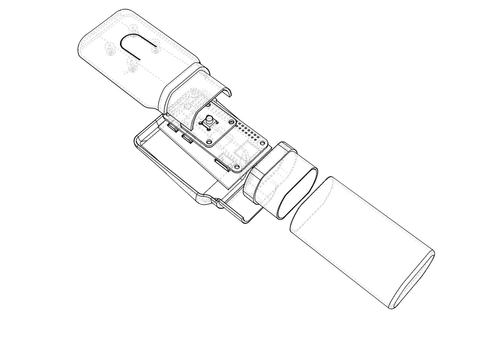

## Dimensione componenti

- Raspberry PI zero W: 			32x68x6 mm

- antenna rfid RC522: 			39x60x6 mm
s
- powerbank: 				94x24x23 mm

- pulsante switch 			6x6x7 mm
- Bluetooth Speaker esterno

## Hardware

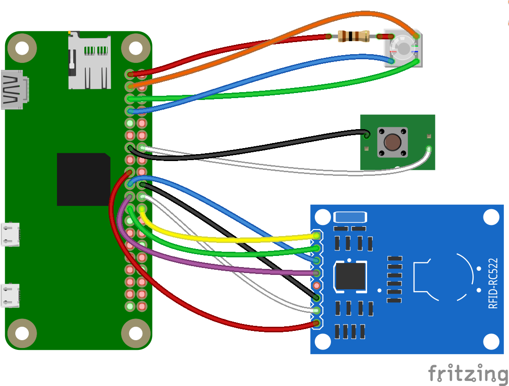
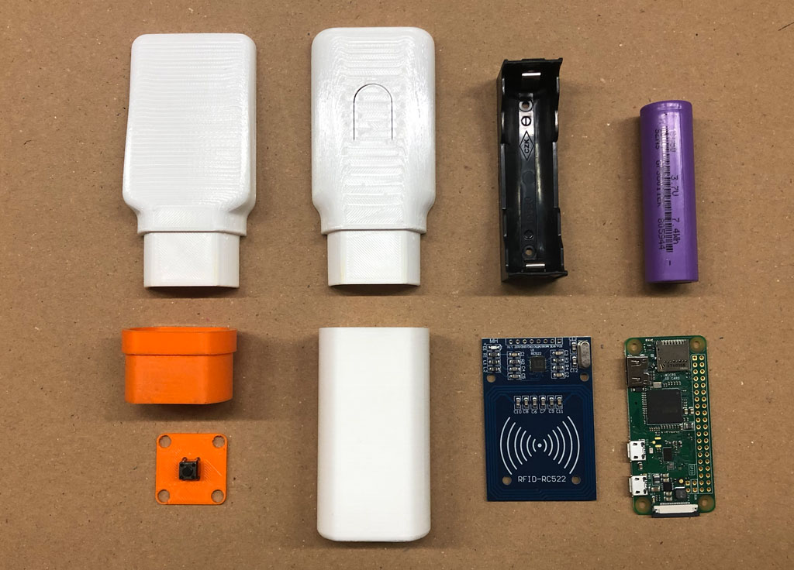

## The 3d printing model

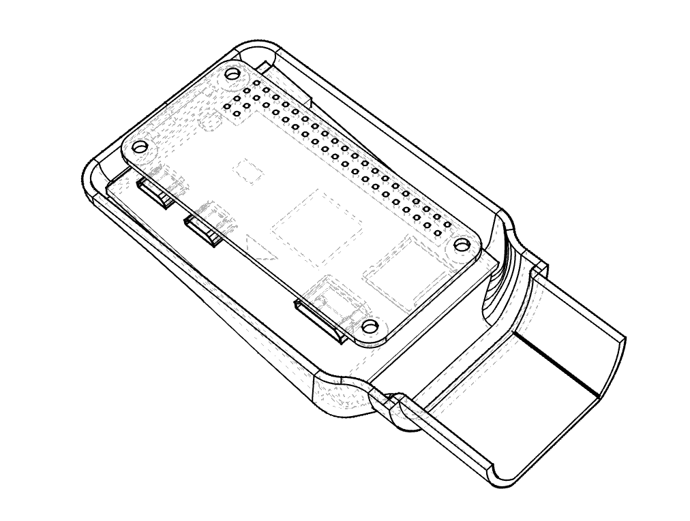
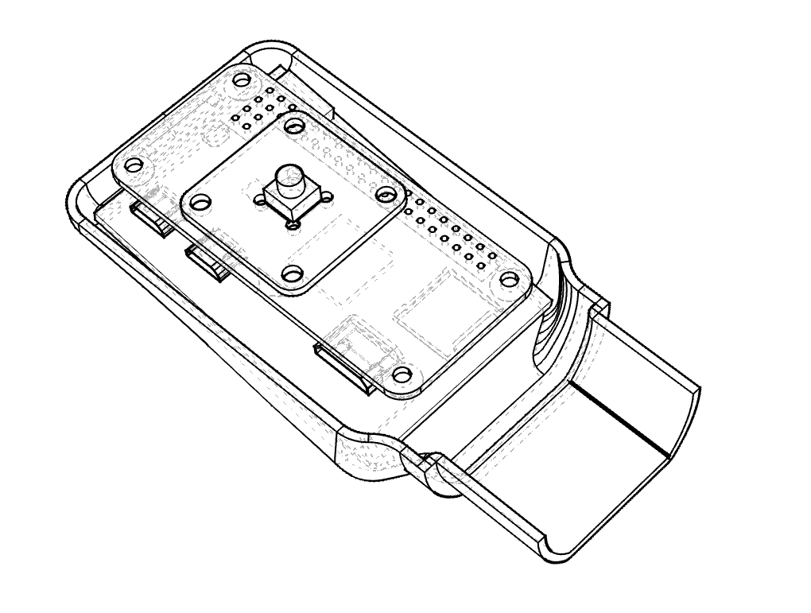
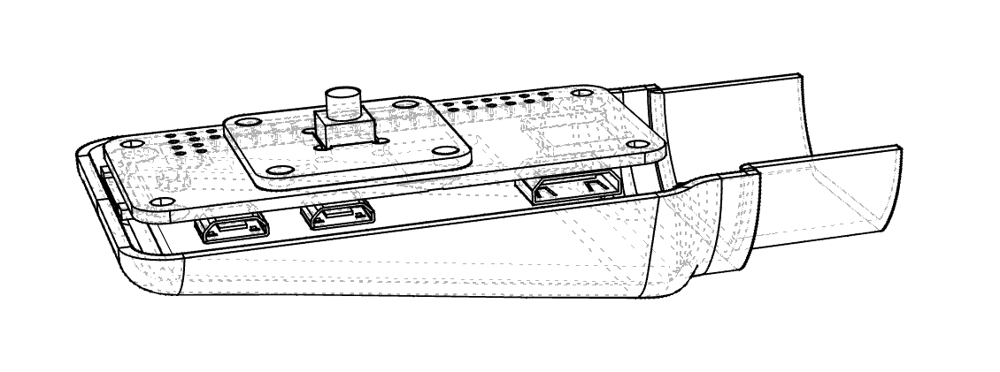
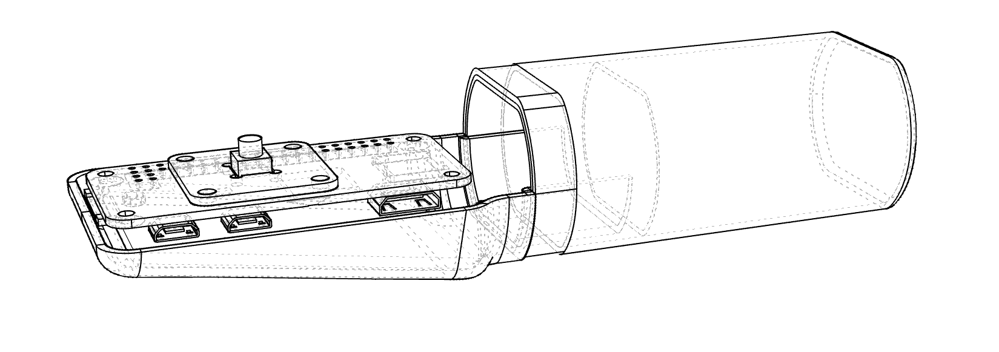
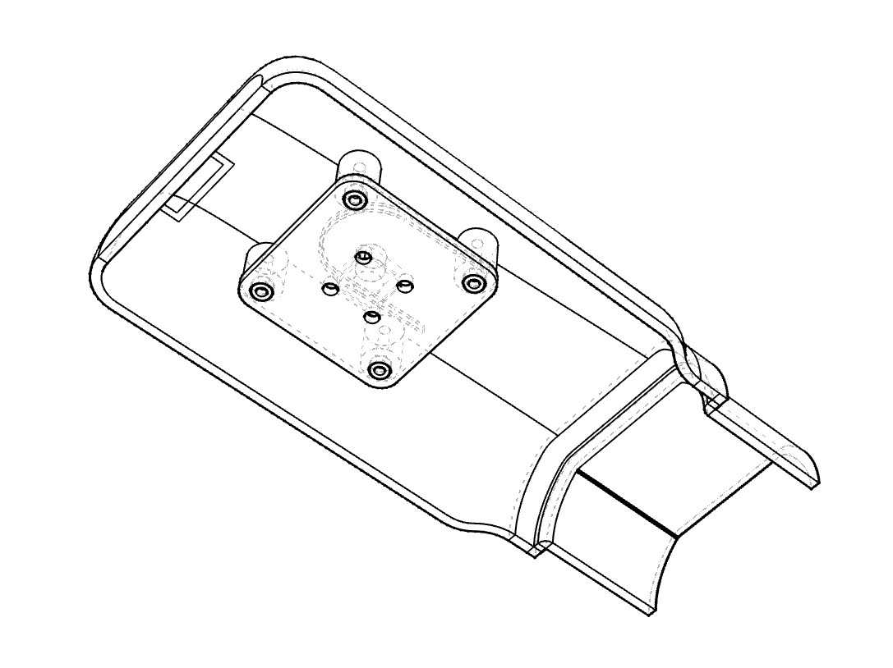
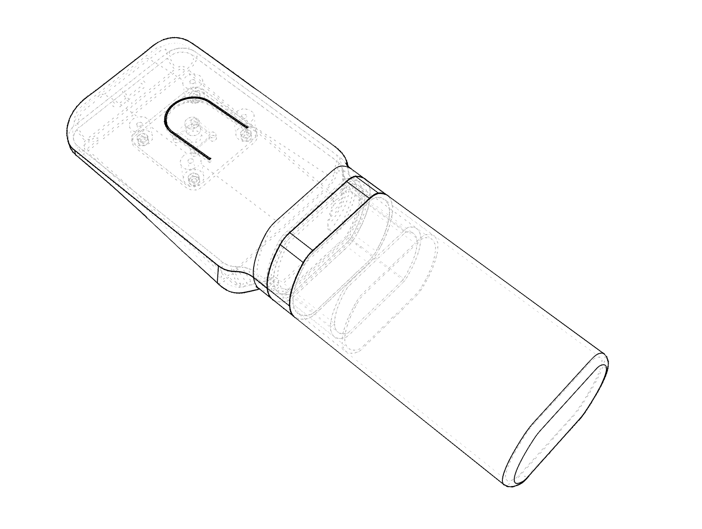

## The prototypes

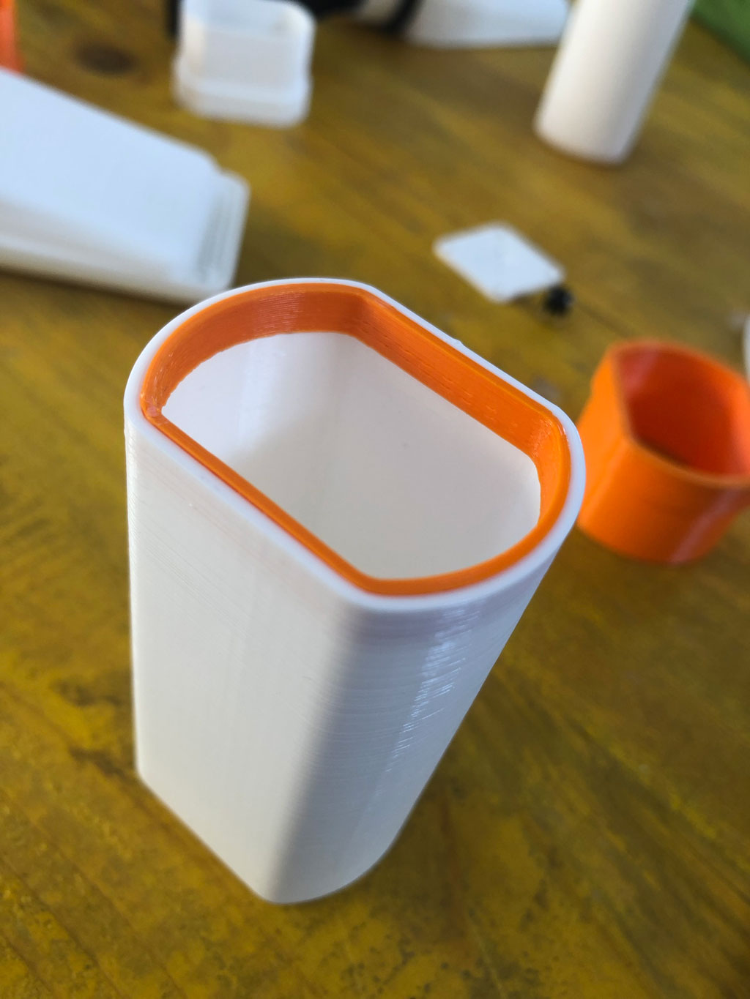
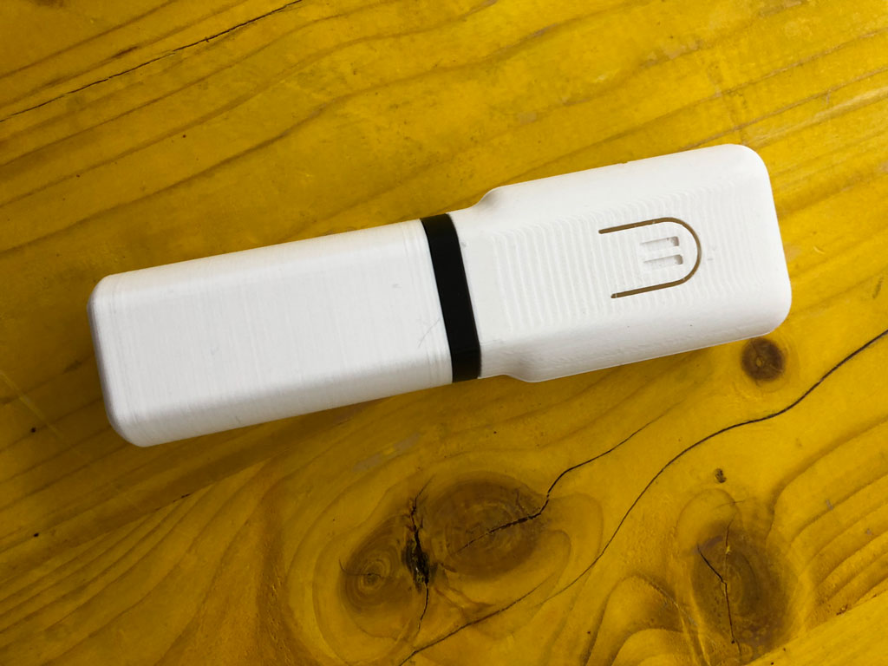

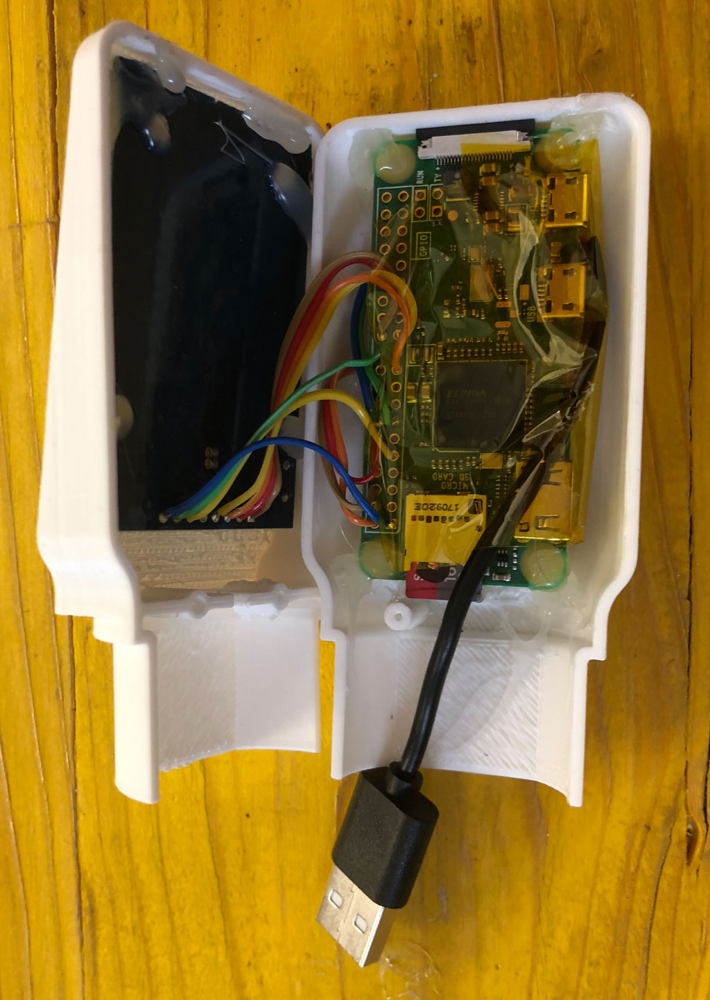

## License

Attribution-NonCommercial 4.0 International (CC BY-NC 4.0)
the  [license](https://creativecommons.org/licenses/by-nc/4.0/legalcode). [Disclaimer](https://creativecommons.org/licenses/by-nc/4.0/#).

Share — copy and redistribute the material in any medium or format
Adapt — remix, transform, and build upon the material
The licensor cannot revoke these freedoms as long as you follow the license terms.
Authors: Alessandra Bosco, Elena La Maida, Emanuele Lumini, Mirco Piccin e Michele Zannoni
