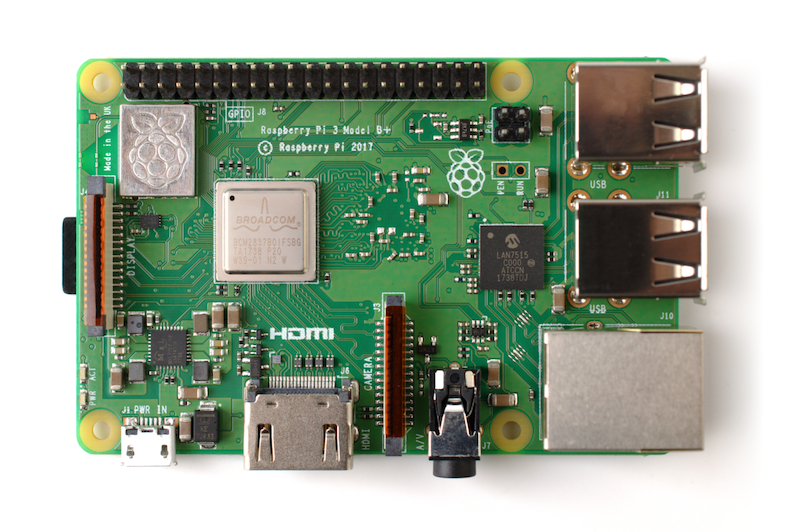

# Modulo Server

Il server ha due componenti, una sviluppata in PHP e MYSQL che può risiedere anche su un server online e una locale installata su una Raspberry PI 3 sviluppata in Node-RED sviluppata per migliorare lo streaming video.

## Password e user delle ISO e del server
La password di default dell'utente "pi" dell'ISO è "password"

La password di default di Node-Red dell'utente "admin" è "password"

La password di default del sistema di gestione dei contenuti multimediali dell'utente "admin" è "password"

- [Download ISO 20190929 v.07a](https://www.dropbox.com/s/mdmm8pqs013waee/20190929_Iso_base_CCM.img.zip?dl=0)
- [Last Node-Red flow](node-red/flows_casamuseorpi.json)

## Hardware

- Raspberry PI 3 B+

- [modelli Rhinoceros]()
