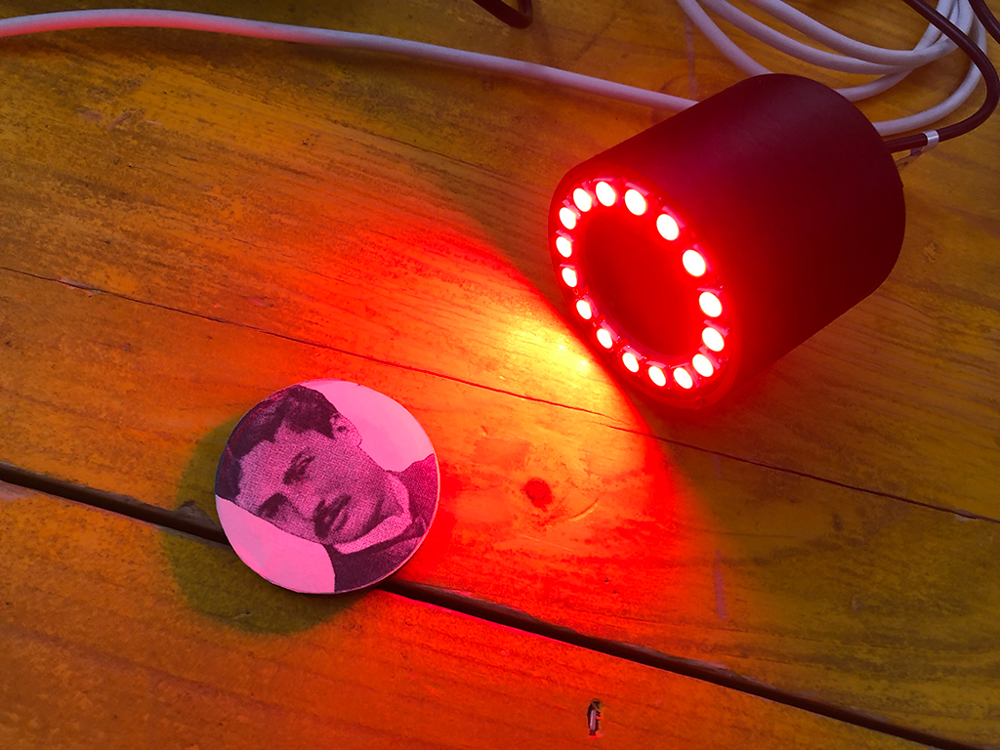

# Modulo Spot Light Neopixel

Alimentato con un powerbank è pensato per essere inserito in contesti privi di rete elettrica.

## Hardware

- Wemos D1 R2 & mini
- Adafruit NeoPixel

## License

Attribution-NonCommercial 4.0 International (CC BY-NC 4.0)
the  [license](https://creativecommons.org/licenses/by-nc/4.0/legalcode). [Disclaimer](https://creativecommons.org/licenses/by-nc/4.0/#).

Share — copy and redistribute the material in any medium or format
Adapt — remix, transform, and build upon the material
The licensor cannot revoke these freedoms as long as you follow the license terms.
Authors: Mirco Piccin e Michele Zannoni
